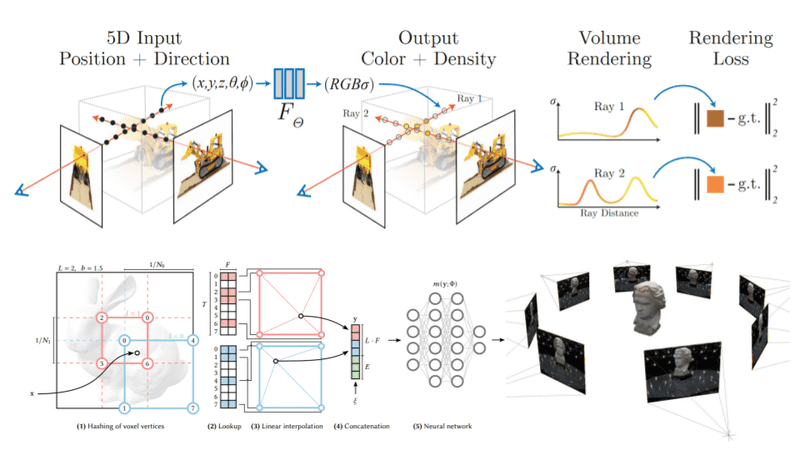
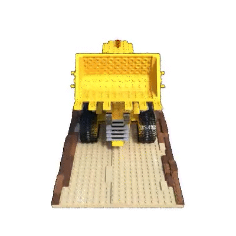
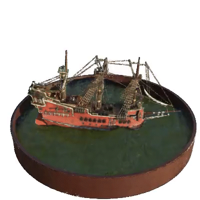

# NERF-torch

## Overview

This repository contains a PyTorch implementation of **NeRF: Representing Scenes as Neural Radiance Fields for View Synthesis**. NeRF is a groundbreaking method introduced by Mildenhall et al. in their ECCV 2020 paper, which enables the synthesis of novel views of complex 3D scenes.

|  |
|:--:|

## Description

NeRF represents scenes as neural radiance fields, enabling high-fidelity 3D scene reconstruction and view synthesis. This implementation leverages PyTorch for efficient computation and training. Whether you're a researcher looking to dive into state-of-the-art neural rendering or a developer interested in 3D graphics and computer vision, this project provides a robust starting point.

## Getting Started

Follow these steps to set up your environment, install dependencies, and begin training your own NeRF models.

### Setup Environment

To configure the Python virtual environment and install dependencies, run the following commands in your shell:

```sh
# Clone the repository
git clone https://github.com/shub-garg/NERF-torch.git
cd NERF-torch
```

# Create virtual environment
```
virtualenv venv -p python3.8
source venv/bin/activate
```

# Install dependencies
```
pip install -r requirements.txt
```
You may use alternative tools like conda if preferred. Ensure the correct dependency versions are installed to reproduce the results.

# Download Dataset
Download the synthetic dataset required for training by running the script below:
```bash
sh scripts/download_data.sh
```

This script creates a data directory under the project root (torch-NeRF) and downloads datasets provided by the original NeRF authors.

# Training
The configuration is pre-set for the lego scene from the Blender dataset. Start training by running:
```bash
python torch_nerf/runners/run_train.py
```

# Rendering
Once the scene representation is trained, render it using:
```bash
python torch_nerf/runners/run_render.py
```

Update the yaml configuration file under config/train_params to specify the path to the checkpoint file. The rendered images will be saved in the render_out directory.

# Create Video
To compile the rendered frames into a video, use the following script:
```bash
python scripts/make_video.py
```

# Images

<p align="middle">
  
  
  
  
  
  </p>
